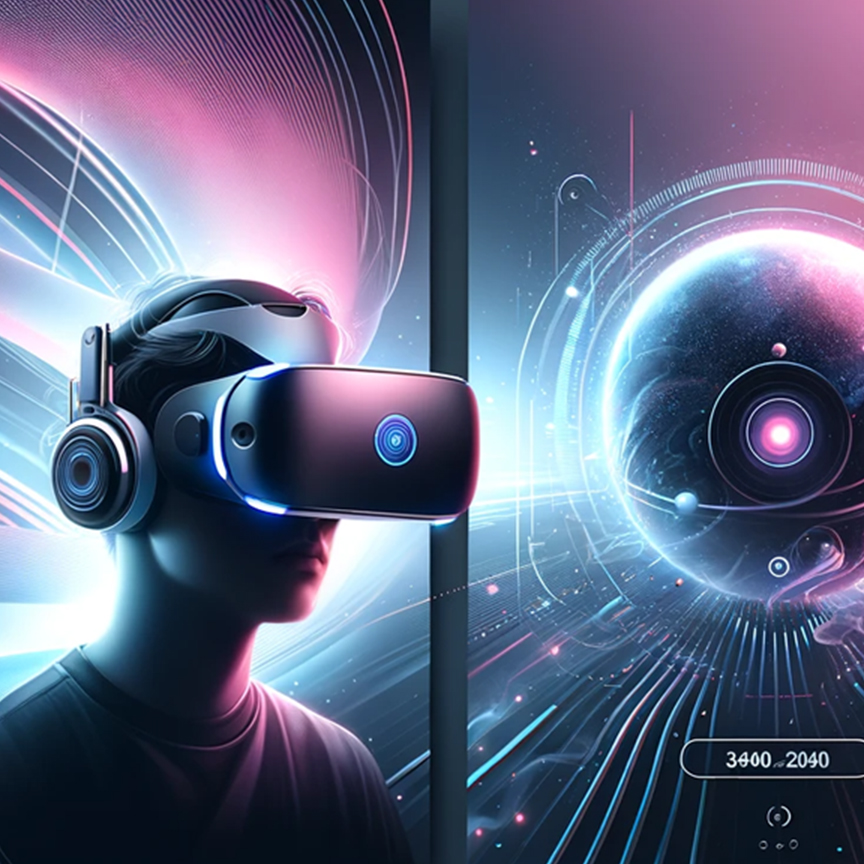
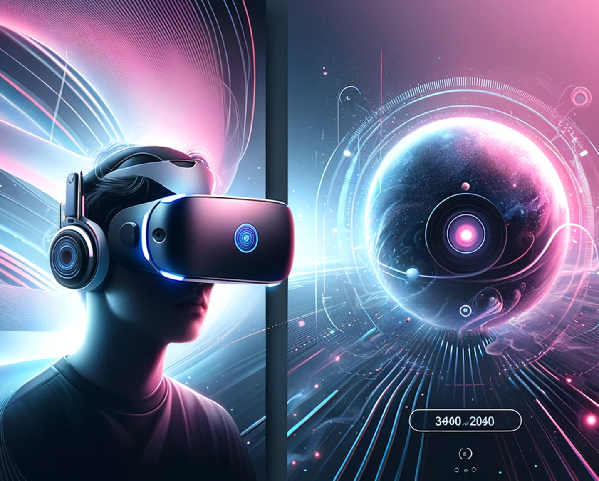

# 바닐라 JS 프로젝트 성능 개선

- url: https://anveloper.dev/front_5th_chapter4-2_basic/

# 성능 개선 보고서

- 개선 이유
  - [개선 전 상태](#개선-전-상태)
  - [예측되는 문제 사항](#예측되는-문제-사항)
- 개선 방법
  - [코드상 주요 개선 조치](#코드상-주요-개선-조치)
  - [배포간 주요 개선 조치](#배포간-주요-개선-조치)
- 개선 후 향상된 지표
  - [개선 후 상태](#개선-후-상태)
  - [개선 결과](#개선-결과)
- 기타
  - [분석 요약](#분석-요약)
  - [회고 및 과제 피드백](#회고-및-과제-피드백)
  - [리뷰받고 싶은 내용](#리뷰받고-싶은-내용)

## 개선 전 상태

### 🎯 Lighthouse 점수
| 카테고리 | 점수 | 상태 |
|----------|------|------|
| Performance | 72% | 🟠 |
| Accessibility | 82% | 🟠 |
| Best Practices | 75% | 🟠 |
| SEO | 82% | 🟠 |
| PWA | 0% | 🔴 |

### 📊 Core Web Vitals (2024)
| 메트릭 | 설명 | 측정값 | 상태 |
|--------|------|--------|------|
| LCP | Largest Contentful Paint | 14.78s | 🔴 |
| INP | Interaction to Next Paint | N/A | 🟢 |
| CLS | Cumulative Layout Shift | 0.011 | 🟢 |


### 개선 전 PageSpeed 측정 결과

- Desktop
  

- Mobile
  

### 예측되는 문제 사항

- 이미지 최적화가 가장 큰 문제로 보임
- 가장 큰 이미지가 1.1mb 데스크탑 Hero 이미지로 원본 그대로를 노출중에 있음
- 이미지이 기본 크기가 설정되지 않아 레이아웃이 밀리는 현상이 있음
- js 스크립트 중, 불필요한 로직이 있고, 필수가 아님에도 초기에 동기적으로 접근하여 랜더링에 영향을 줌
- css 파일 중 외부에서 사용중인 폰트 파일이 전체 레이아웃의 변화에 영향을 줌

## 조치 사항


### 코드상 주요 개선 조치

- Desktop
  | 조치                                                         | 설명                   |
  | ---------------------------------------------------------- | -------------------- |
  | **Hero 이미지에 `width`, `height`, `fetchpriority="high"` 추가** | LCP와 CLS 동시 개선       |
  | **불필요 preload 제거 / 선택적 preload 전환**                        | 초기 네트워크 부하 경감        |
  | **웹폰트 `font-display: swap` 설정**                            | 초기 렌더링 블로킹 제거        |
  | **JS 실행 블로킹 감소 / GTM 최적화**                                 | TBT 0ms로 개선          |
  | **이미지 크기 및 압축 재조정**                                        | 데스크탑 기준에서도 최적 크기만 전달 |

- Mobile
  | 조치 항목                 | 내용                                                                      |
  | --------------------- | ----------------------------------------------------------------------- |
  | **Hero 이미지 구조 개선**    | `<picture>` 사용 + ``에 `width/height` 명시 + `fetchpriority="high"` 적용 |
  | **이미지 리사이즈 및 용량 최적화** | WebP 사용, 모바일 전용 이미지 별도 분기, Squoosh 등으로 품질 70\~75 압축                     |
  | **불필요 preload 제거**    | `<link rel="preload">` 조건부 분기 제거 또는 JS 로딩 전환                            |
  | **CLS 발생 요소 정리**      | 폰트 로딩 및 이미지 공간 확보, 레이아웃 요소 크기 고정                                        |
  | **스크립트 최적화**          | 사용하지 않는 GTM 제거 또는 지연 로딩 적용                                              |


### 배포간 주요 개선 조치

- 배포시에 이미지 파일을 `*.webp`로 변환
- 배포시에 `*.js`, `*.css` 파일은 `*.min.js`, `*.min.css` 파일로 압축
- 수동 압축도 가능하지만, github actions를 통한 자동화로 진행

  - imagemin-cli, imagemin-webp: 이미지 파일을 *.webp로 변환하는 라이브러리
    ```yml
          - name: Convert images to WebP
            run: |
              imagemin images/*.{png,jpg,jpeg} --plugin=webp --out-dir=dist/images
    ```
  - (추가) imagemin 만으로는 해상도 조절이 안되서, cwebp 로 라이브러리 변경, 컴포넌트 랜더링에 정확히 맞는 사이즈로 변경
    ```yml
          - name: Convert images to WebP
            run: |
              mkdir -p dist/images
              cwebp -resize 1905 886 -q 80 images/Hero_Desktop.jpg -o dist/images/Hero_Desktop.webp
              cwebp -resize 934 749 -q 80 images/Hero_Tablet.jpg -o dist/images/Hero_Tablet.webp
              cwebp -resize 618 618 -q 80 images/Hero_Mobile.jpg -o dist/images/Hero_Mobile.webp
              cwebp -resize 200 200 -q 80 images/vr1.jpg -o dist/images/vr1.webp
              cwebp -resize 200 200 -q 80 images/vr2.jpg -o dist/images/vr2.webp
              cwebp -resize 200 200 -q 80 images/vr3.jpg -o dist/images/vr3.webp
              cwebp -resize 36 26 -q 80 images/menu_icon.png -o dist/images/menu_icon.webp
    ```
    
  - cleancss: *.min.css 파일로 압축하는 라이브러리
    ```yml
        - name: Minify CSS
          run: |
            cleancss -o dist/assets/styles.min.css dist/assets/styles.css
            rm dist/assets/styles.css
    ```

  - terser: *.min.js 파일로 압축하는 라이브러리
    ```yml
          - name: Minify JS
            run: |
              terser dist/assets/main.js -o dist/assets/main.min.js --compress --mangle
              terser dist/assets/products.js -o dist/assets/products.min.js --compress --mangle
              rm dist/assets/main.js dist/assets/products.js
    ```
  - gh-pages 브랜치에서만 최적화된 이미지 사용
  - *.min.css, *.min.js 파일로 소스 압축
  - main 브랜치는 원본 소스만 유지
  
    

- 초기 랜더링 속도개선을 위한 비동기 로딩 추가
- 필수 랜더링 요소를 제외한 스크립트 defer 추가
  ```js
  <script defer>
      (function (w, d, s, l, i) {
  /* ... */
  </script>
  <script type="text/javascript" src="//www.freeprivacypolicy.com/public/cookie-consent/4.1.0/cookie-consent.js" charset="UTF-8" defer></script>
  <script type="text/javascript" charset="UTF-8">
    window.addEventListener("DOMContentLoaded", () => {
      cookieconsent.run({
  /* ... */
  </script>
  ```
  
- 폰트 파일을 로컬에서 직접 제공하도록 변경 
  ```css
  @font-face {
    font-family: "Heebo";
    src: url("fonts/Heebo-Light.woff2") format("woff");
    font-display: swap;
    font-weight: 300;
    font-style: light;
  }
  /* ... */
  ```
- Hero 이미지  랜더링 개선, webp 변환, picture source 방식으로 변경
  ```html
      <section class="hero">
        <!--  -->
        <!--  -->
        <!--  -->
        <picture>
          <source srcset="images/Hero_Mobile.webp" type="image/webp" media="(max-width: 576px)" />
          <source srcset="images/Hero_Tablet.webp" type="image/webp" media="(max-width: 960px)" />
          <source srcset="images/Hero_Desktop.webp" type="image/webp" media="(min-width: 961px)" />
          
        </picture>
      <!-- ... -->
      </section>
  ```

## 개선 후 상태

### 🎯 Lighthouse 점수
| 카테고리 | 점수 | 상태 |
|----------|------|------|
| Performance | 76% | 🟠 |
| Accessibility | 94% | 🟢 |
| Best Practices | 61% | 🟠 |
| SEO | 100% | 🟢 |
| PWA | 0% | 🔴 |

### 📊 Core Web Vitals (2024)
| 메트릭 | 설명 | 측정값 | 상태 |
|--------|------|--------|------|
| LCP | Largest Contentful Paint | 2.49s | 🟢 |
| INP | Interaction to Next Paint | N/A | 🟢 |
| CLS | Cumulative Layout Shift | 0.561 | 🔴 |
 
### 개선 후 PageSpeed 측정 결과

- Desktop
  

- Mobile
  

## 개선 결과

### 측정 요약

- Desktop
  | 항목                                 | 개선 전  | 개선 후        | 변화                             |
  | ---------------------------------- | ----- | ----------- | ------------------------------ |
  | **성능 점수**                          | 90점   | ✅ **100점**   | ▲ +10점 향상                       |
  | **First Contentful Paint (FCP)**   | 0.6초  | ✅ **0.3초**  | 매우 빠르게 개선됨                     |
  | **Largest Contentful Paint (LCP)** | 2.0초  | ✅ **0.6초**  | 핵심 지표 절반 이하로 감소                |
  | **Total Blocking Time (TBT)**      | 70ms  | ✅ **0ms**   | 자바스크립트 최적화 성공                  |
  | **Speed Index**                    | 0.6초  | ✅ **0.9초** | 체감 시각적 렌더링 속도는 약간 늦어짐          |
  | **Cumulative Layout Shift (CLS)**  | 0.011 | ✅ **0.014** | 안정적 (오히려 LCP 관련 개선 영향으로 더 안정됨) |

- Mobile
  | 항목                                 | 개선 전  | 개선 후    | 비고                                |
  | ---------------------------------- | ----- | ------- | --------------------------------- |
  | **성능 점수**                          | 54점   | ✅ 93점   | ▲ +39점 향상                         |
  | **FCP** (First Contentful Paint)   | 2.4초  | ✅ 1.2초  | 초기 콘텐츠 도달 시간 단축                   |
  | **LCP** (Largest Contentful Paint) | 5.8초  | ✅ 2.9초  | 주 콘텐츠 렌더링 시간 크게 개선                |
  | **CLS** (Cumulative Layout Shift)  | 0.405 | ✅ 0.018 | 레이아웃 안정성 확보                       |
  | **Total Blocking Time**            | 170ms | ✅ 0ms   | 스크립트 블로킹 제거                       |
  | **Speed Index**                    | 2.4초  | ⚠️ 3.8초 | 시각적 로딩 체감 속도는 다소 낮아짐 (대신 안정성 확보됨) |


## 분석 요약

- 데스크탑 환경에서의 성능은 최대치 수준으로 개선이 되었음
- 모바일 환경도 54점에서 93점으로 개선이 되었지만, LCP는 더 개선할 요소가 있는것으로 보임
- 항목중 speed index 값이 증가되었다고 측정되었는데, 동적으로 실행되는 쿠키 허용 팝업이 개선전 상태에선 랜더링이 안되는 오류 상태로 측정 왜곡이 발생한 것이 아닌가 생각됨
- 프레임워크의 빌드 과정처럼 *.min.js 로 압축하는 과정을 deploy에서 수행했는데, 코드량이 많지 않아 큰 차이를 보이지는 않음
- 마찬가지로 main 브랜치의 원본 소스를 유지하기 위해 webp 파일도 deploy과정에서 변환하는데, 압축률을 80정도로 진행함
- 이미지 변환 시 압축률을 더 줄여 speed index를 더 줄일수도 있지만, 이미지가 보기에 너무 압축되면 사용자 경험이 안좋아 질것으로 판단 80로 설정함

## 회고 및 과제 피드백

- 회사에서 `Next.js` 위주의 프레임 워크를 주로 작업을 하고있고, `<Image/>` 컴포넌트에서 최적화를 해주는 것을 주로 이용해왔습니다.
- 성능 지표를 확인하며 어떻게 작업하면 수치적으로 얼마나 개선되는 지 확인 할 수 있는 경험이 좋았습니다.
- 회사 솔루션 중 12년이 넘은 `Vanilla JS`로 구축된 프로젝트에 `.tpl` 이라는 파일 확장자로 페이지를 랜더링 해주는 부분이 있는데, 코드량이 방대하여 완벽한 개선은 시도하기 어려운 부분이 있었습니다.
- 이번 과제를 통해 `js`나 `css` 로드 방식이라도 조금씩 개선해 나갈 수 있을 것 같다는 생각이 들었습니다.
 
## 리뷰받고 싶은 내용

- 과제를 진행하면서 어느 순간 사용자 경험이 아니라 수치 자체를 100으로 맞추는 것이 목표가 되버리는 상태가 되었던 것 같습니다.
- 실제 E2E 테스트나 직접 사이트를 조작하여 동작 상태를 확인하는 것과 병행이 되어야 하지 않을까? 하는 의문이 중간에 들었었습니다.
  - 순수하게 지표만 끌어 올리는 작업이 실제 사용자 경험에 긍정적인 영향을 준다고 볼 수 있는 지?
  - 혹시나 지표에 측정되는 부분만 개선하고, 실제 사용자는 수많은 비동기 동작들로 인해 의미없는 개선이 되진 않는 지?
- 이런 부분들을 개선 과정에서 해소하고 지나갈 수 있는 방법이 무엇이 있는 지 궁금합니다. 
